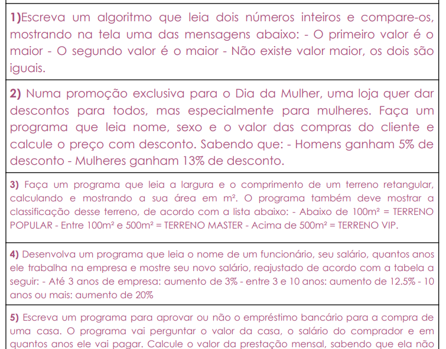

<h1>Treino</h1>
esse é um pequeno treino que estou fazendo. minha porfessora passou uma lista de exercicios para nossa turma que começou a aprender php básico.

segue print do nivel das questões

nota: dei esse "treino" por finalizado, fiz de um jeito que funciona, mas provavelmente não é a melhor maneira de fazer.